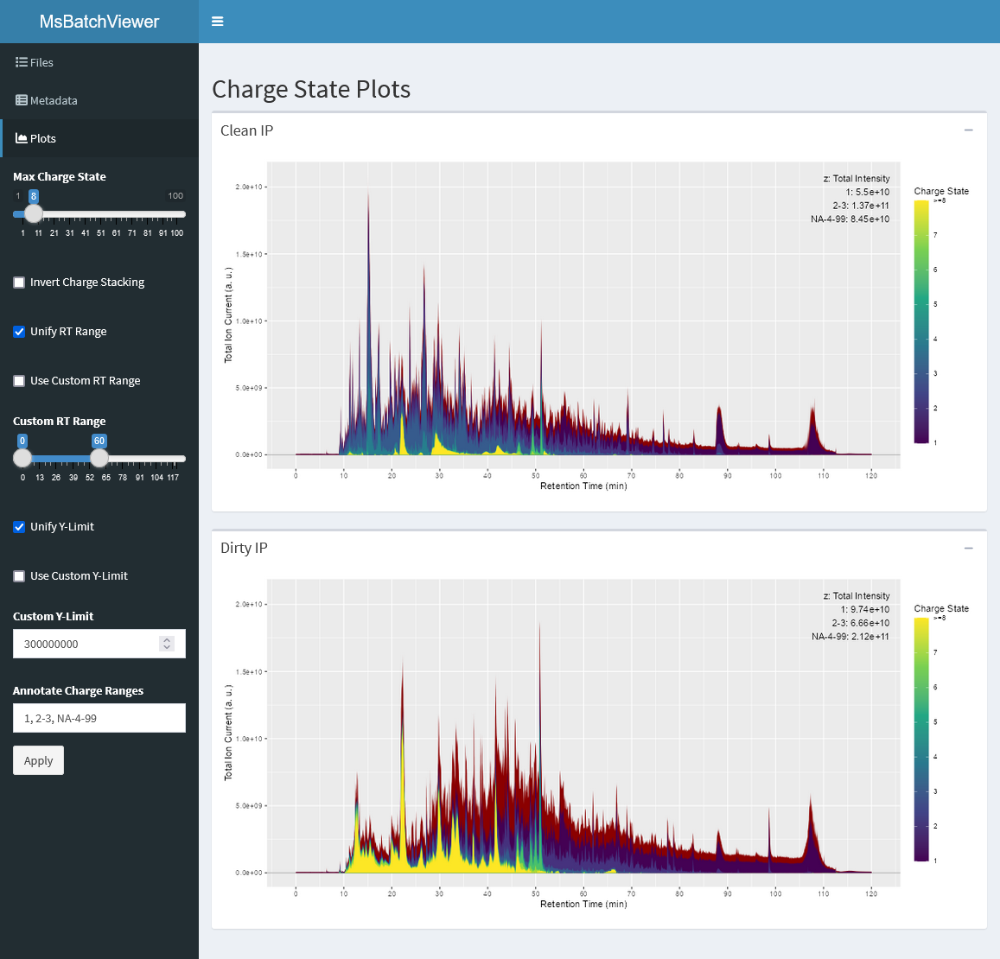

# MsBatchViewer

A tool for opening multiple Thermo MS rawfiles (.raw) to plot charge state resolved total ion current chromatograms and inspect metadata.
Charge state resolved TIC chromatograms are especially useful for immunopeptidomics.

## Screenshot

## Requirements

Download the repository and extract it into a directory.

The following software is expected to be installed:
* R ≥ v4.2.0 (https://cran.r-project.org/)

Initialize the R environment by running configure.cmd

## Run the Viewer

Run MsBatchViewer.cmd
